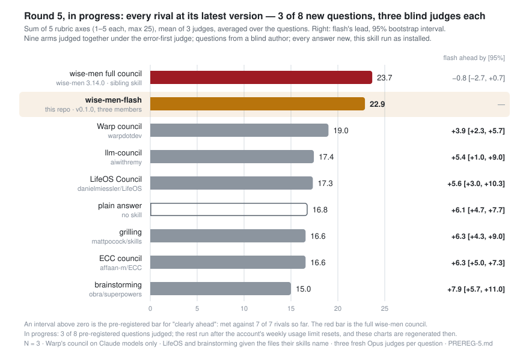
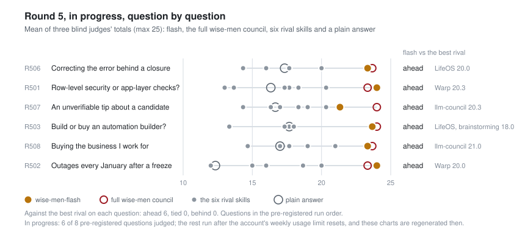
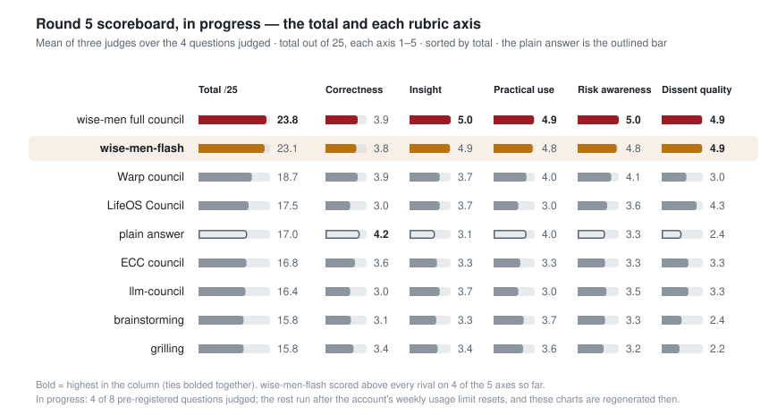
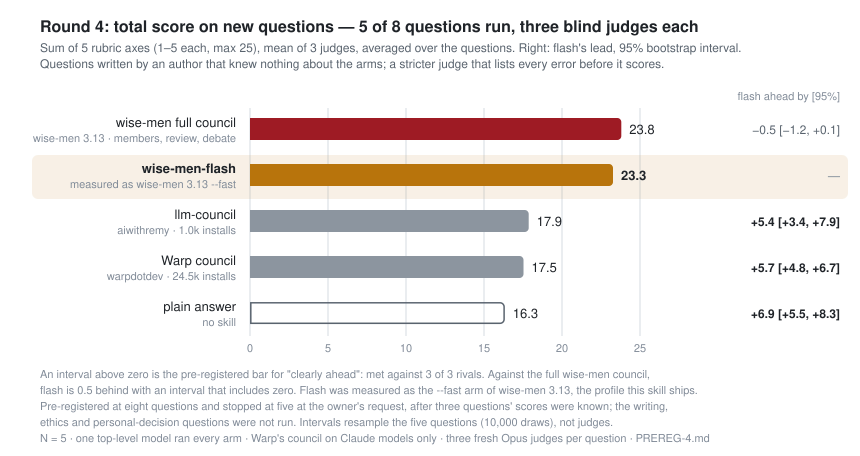
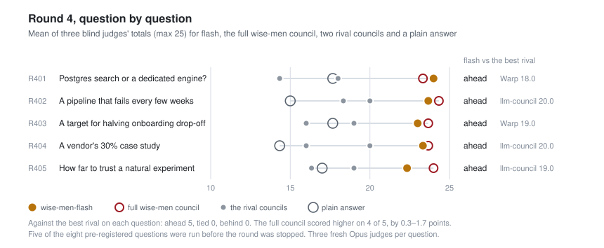
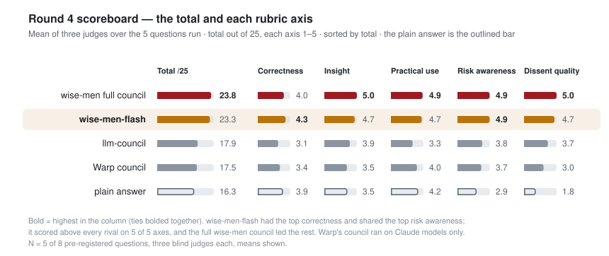
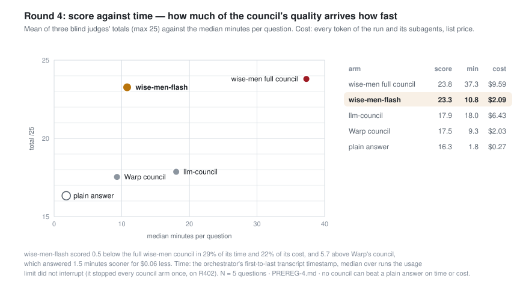
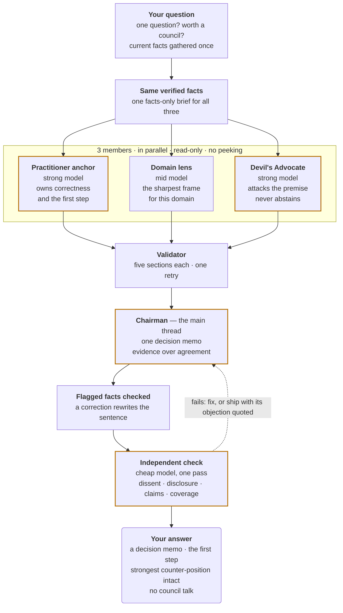

<p align="center"></p>

[](https://github.com/Ali-expandings/wise-men-flash/stargazers) [](LICENSE) [](https://github.com/Ali-expandings/wise-men-flash/actions/workflows/check.yml) [](#install)

The fast tier of the [wise-men](https://github.com/Ali-expandings/wise-men) council, as its own skill. Three Claude subagents answer your question in parallel, each down a different line of reasoning; one decision memo comes back, checked before you see it, with the strongest case against it kept intact. About eleven minutes, four subagent calls.

<p align="center">
  <strong>Clearly ahead of every rival council on every question it was tested on — 23.3/25 against llm-council 17.9, Warp's council 17.5 and a plain answer 16.3 — and within half a point of the full wise-men council (23.8) in under a third of its time: 10.8 minutes and four subagent calls a question</strong><br>
  <sub>Pre-registered blind head-to-head on five questions new to the project, three blind judges each, under a judge prompt that lists every error before it scores. Measured as the <code>--fast</code> arm of wise-men 3.13, the profile this skill ships. Its own round, run as installed against every rival at its latest version, is in progress: 3 of 8 questions judged, ahead of all seven rivals on each. <a href="#does-it-work">Charts, method and caveats</a>.</sub>
</p>

```
/plugin marketplace add Ali-expandings/wise-men-flash
/plugin install wise-men-flash@wise-men-flash
```

Then: *"flash council: should we move everyone to annual billing to cut churn?"*

---

## Does it work?

**Round 5 — in progress, 3 of 8 questions judged** (pre-registered in [`PREREG-5.md`](eval-data/head-to-head/PREREG-5.md) before its questions were written). This skill, run as installed, next to the full wise-men council (3.14.0) and every rival the wise-men study has tested — Warp's council, llm-council, LifeOS Council, ECC's council, superpowers brainstorming and mattpocock grilling, each at its latest version — plus a plain answer. Eight new questions from a blind author, one of each kind; every answer new; three blind Opus judges per question under the error-first judge. This is the standalone measurement the caveats below promised (it supersedes `PREREG-1`). The remaining five questions run after the account's weekly usage limit resets, and the table and charts below are regenerated as each one is judged.

<p align="center"><picture><source media="(prefers-color-scheme: dark)" srcset="assets/round5-dark.svg"></picture></p>

| round 5 (3 of 8 questions) | total /25 | correct | insight | practical | risk | dissent | median minutes | median calls | median list-price USD |
|---|--:|--:|--:|--:|--:|--:|--:|--:|--:|
| wise-men 3.14.0 | 23.7 | 3.9 | 5.0 | 4.9 | 5.0 | 4.9 | 49.1 | 16 | 15.64 |
| **wise-men-flash 0.1.0** | 22.9 | 3.7 | 4.9 | 4.7 | 4.7 | 5.0 | 16.8 | 4 | 3.93 |
| Warp council | 19.0 | 4.0 | 3.7 | 4.0 | 4.1 | 3.2 | 11.3 | 3 | 2.83 |
| llm-council | 17.4 | 3.3 | 3.9 | 3.2 | 3.7 | 3.3 | 15.7 | 11 | 4.52 |
| LifeOS Council | 17.3 | 3.0 | 3.8 | 2.9 | 3.4 | 4.2 | 8.7 | 12 | 3.90 |
| plain answer | 16.8 | 4.2 | 3.0 | 4.0 | 3.3 | 2.2 | 1.6 | 0 | 0.26 |
| mattpocock grilling | 16.6 | 3.8 | 3.6 | 3.8 | 3.2 | 2.2 | 4.9 | 0 | 0.59 |
| ECC council | 16.6 | 3.4 | 3.3 | 3.3 | 3.4 | 3.0 | 5.1 | 3 | 1.49 |
| superpowers brainstorming | 15.0 | 2.9 | 3.2 | 3.6 | 3.1 | 2.2 | 5.2 | 0 | 0.68 |

- wise-men-flash 0.1.0 against wise-men 3.14.0: −0.8 [−2.7, +0.7], W–T–L 1–0–2 — behind, with an interval that includes zero.
- wise-men-flash 0.1.0 against Warp council: +3.9 [+2.3, +5.7], W–T–L 3–0–0 — clearly ahead.
- wise-men-flash 0.1.0 against llm-council: +5.4 [+1.0, +9.0], W–T–L 3–0–0 — clearly ahead.
- wise-men-flash 0.1.0 against LifeOS Council: +5.6 [+3.0, +10.3], W–T–L 3–0–0 — clearly ahead.
- wise-men-flash 0.1.0 against ECC council: +6.3 [+5.0, +7.3], W–T–L 3–0–0 — clearly ahead.
- wise-men-flash 0.1.0 against superpowers brainstorming: +7.9 [+5.7, +11.0], W–T–L 3–0–0 — clearly ahead.
- wise-men-flash 0.1.0 against mattpocock grilling: +6.3 [+4.3, +9.0], W–T–L 3–0–0 — clearly ahead.
- wise-men-flash 0.1.0 against plain answer: +6.1 [+4.7, +7.7], W–T–L 3–0–0 — clearly ahead.
- wise-men-flash 0.1.0: beats every rival — clearly ahead of all seven.

- Axes, wise-men-flash 0.1.0: the highest dissent quality of the nine arms; above every rival on 4 of 5 axes.
- Time and cost, wise-men-flash 0.1.0: median 16.8 min and $3.93 a question; faster than no rival council, cheaper than llm-council.

Judge agreement: mean SD of the three judges' totals 0.71.

<p align="center"><picture><source media="(prefers-color-scheme: dark)" srcset="assets/round5-questions-dark.svg"></picture></p>

<p align="center"><picture><source media="(prefers-color-scheme: dark)" srcset="assets/round5-axes-dark.svg"></picture></p>

So far flash is ahead of all seven rivals on every question judged, and 0.8 behind the full wise-men council overall, with an interval that includes zero. Correctness is its weakest axis (3.7), below the plain answer, Warp's council and grilling. Three questions are too few to rest a claim on; the pre-registered claims apply to the finished round. Per-question scores, run times, costs and disclosures so far: [`RESULTS-V5.md`](eval-data/head-to-head/RESULTS-V5.md).

**Round 4** — the round that first measured this profile, as an arm inside wise-men.

Round 4 of the wise-men head-to-head ([pre-registered](eval-data/head-to-head/PREREG-4.md) before any run) put five ways of answering against eight questions written for the round by an author that knew nothing about the skills being tested: the full wise-men council; its three-member `--fast` profile, which is the profile this skill ships; Warp's council, the most-installed general-purpose council skill, and llm-council; and a plain answer with no skill. For every question, three fresh Opus judges read the five answers under letters, each in its own sealed order, listed every error they could find, then scored five axes. The round was stopped at five of its eight questions to conserve usage.

<p align="center"><picture><source media="(prefers-color-scheme: dark)" srcset="assets/round4-dark.svg"></picture></p>

| round 4 (5 of 8 questions) | total /25 | correct | insight | practical | risk | dissent | median minutes | median calls | median list-price USD |
|---|--:|--:|--:|--:|--:|--:|--:|--:|--:|
| wise-men 3.13 full council | 23.8 | 4.0 | 5.0 | 4.9 | 4.9 | 5.0 | 37.3 | 11 | 9.59 |
| **wise-men-flash** (measured as wise-men 3.13 `--fast`) | 23.3 | 4.3 | 4.7 | 4.7 | 4.9 | 4.7 | 10.8 | 4 | 2.09 |
| llm-council | 17.9 | 3.1 | 3.9 | 3.3 | 3.8 | 3.7 | 18.0 | 11 | 6.43 |
| Warp council | 17.5 | 3.4 | 3.5 | 4.0 | 3.7 | 3.0 | 9.3 | 3 | 2.03 |
| plain answer | 16.3 | 3.9 | 3.5 | 4.2 | 2.9 | 1.8 | 1.8 | 0 | 0.27 |

- wise-men-flash against Warp council: +5.7 [+4.8, +6.7], W–T–L 5–0–0 — clearly ahead.
- wise-men-flash against llm-council: +5.4 [+3.4, +7.9], W–T–L 5–0–0 — clearly ahead.
- wise-men-flash against plain answer: +6.9 [+5.5, +8.3], W–T–L 5–0–0 — clearly ahead.
- wise-men-flash against wise-men 3.13 full council: −0.5 [−1.2, +0.1], W–T–L 1–0–4 — behind, with an interval that includes zero.

- Axes: wise-men-flash had the highest correctness of the five arms, tied with the full council for the highest risk awareness, and scored above every rival on 5 of 5 axes; the full council led insight, practical use and dissent quality.
- Time and cost, medians per question: the plain answer 1.8 min, $0.27; Warp council 9.3 min, $2.03; wise-men-flash 10.8 min, $2.09; llm-council 18.0 min, $6.43; the full wise-men council 37.3 min, $9.59. wise-men-flash was faster and cheaper than the full wise-men council and llm-council; Warp council was 1.5 min quicker and $0.06 cheaper, and scored 5.7 lower.

Judge agreement: mean SD of the three judges' totals 0.58.

Ahead by = mean per-question gap in total score, with a 95% bootstrap interval over questions (10,000 resamples, seed 20260919); W–T–L = questions won, tied and lost on the mean of the three judges. Minutes run from the orchestrator's first to last transcript timestamp; cost prices every token of the run and of every agent it spawned, at list price.

<p align="center"><picture><source media="(prefers-color-scheme: dark)" srcset="assets/round4-questions-dark.svg"></picture></p>

<p align="center"><picture><source media="(prefers-color-scheme: dark)" srcset="assets/round4-axes-dark.svg"></picture></p>

<p align="center"><picture><source media="(prefers-color-scheme: dark)" srcset="assets/round4-speed-dark.svg"></picture></p>

**What it shows.** Flash finished ahead of Warp's council, llm-council and the plain answer on every one of the five questions, by 5.4 to 6.9 points of 25 on average, and every interval excludes zero — under the wording fixed in the pre-registration, it beats every rival. It scored above every rival on all five axes and had the highest correctness of the five arms. Against the full wise-men council it was half a point behind, with an interval that includes zero: the full council scored higher on four questions, by 0.3 to 1.7 points, and flash higher on the first. It got there in 10.8 minutes and $2.09 a question against the full council's 37.3 minutes and $9.59; it was faster and cheaper than llm-council too, while Warp's council answered 1.5 minutes sooner and scored 5.7 points lower.

**The caveats, plainly.**

- **Inherited, not re-measured.** These numbers are the `--fast` arm of wise-men 3.13.0, run inside wise-men before this repository existed. Flash 0.1.0 packages that profile with the rule wise-men added right after the round — nothing about how an answer was produced appears in it — and small changes to its domain seat and Devil's Advocate prompts ([CHANGELOG](CHANGELOG.md)). Those changes are measured by round 5, which is in progress (above).
- **Five questions, three kinds missing.** Pre-registered at eight and stopped at five at the owner's request, after three questions' scores were known — not a blind stop. The writing, ethics and personal-decision questions were never run.
- **The scores carry a penalty this skill now prevents.** Three of the five measured answers closed with a note about how they were produced, and the judges docked it as process residue.
- **One model family.** Every judge and every arm is a Claude model; there are no human grades. Warp's council ran on Claude models only, though its skill asks for a model-diverse council.

Per-question scores, run times, costs and every deviation: [`RESULTS.md`](eval-data/head-to-head/RESULTS.md). Raw answers, blinded packets, judgments and parsed scores: [`eval-data/`](eval-data/). Reproduce with `python3 eval-data/head-to-head/flash4.py report`; `verify` rebuilds every packet the judges read from the raw answers, byte for byte, and re-parses every judgment.

### Its own round

Round 5 ([`PREREG-5.md`](eval-data/head-to-head/PREREG-5.md)) is this skill's own measurement, run as installed, and it supersedes the smaller round first planned in [`PREREG-1.md`](eval-data/PREREG-1.md) (Amendment 2). It fixed in advance what counts: clearly ahead of every rival, and not clearly behind the full council. PREREG-1's third test — the 0.1.0 changes against the 3.13 `--fast` profile — needs the old profile re-run and is not part of round 5.

## What you get

A decision memo, and nothing else:

```
## Recommendation              the decision, in one to three sentences
## Why                         reasons from evidence, each said once
## What to do                  the first step, a time box, when to stop or escalate
## Risks of this plan          both directions, and how reversible following it is
## Strongest counter-position  the best case against the premise the answer leans on
## Confidence                  per load-bearing claim, from evidence — never from agreement
```

No "the panel agreed", no scores, no vote counts, no account of how the answer was made. A footer appears only when something real degraded — a member failed, the restricted agent was missing — or when a fact was corrected against a source.

Two real answers from round 4, verbatim, each with how the three blind judges scored every arm on that question: [an engineering choice](examples/engineering-choice.md) (24.0/25, the top score on its question) and [how far to trust a vendor's number](examples/trust-a-number.md) (23.3/25).

## Install

**Plugin (recommended — the member agent registers itself):**

```
/plugin marketplace add Ali-expandings/wise-men-flash
/plugin install wise-men-flash@wise-men-flash
```

**Or clone into your skills folder:**

```bash
git clone https://github.com/Ali-expandings/wise-men-flash.git ~/.claude/skills/wise-men-flash
mkdir -p ~/.claude/agents && [ -f ~/.claude/agents/wise-member.md ] || cp ~/.claude/skills/wise-men-flash/agents/wise-member.md ~/.claude/agents/
```

The second line matters for the clone path. `wise-member` is a tool-restricted agent — Read, Grep and Glob only; it cannot spawn agents, run commands or edit files — used for every member and for the checker, so a council cannot recurse or touch your files. The plugin install registers it as `wise-men-flash:wise-member`. If the full wise-men skill is already installed, its `wise-member` has the same boundary, so the line keeps it rather than overwriting it. Without either, the skill still runs and says so once: members are then only asked not to spawn.

Requires [Claude Code](https://claude.com/claude-code). No API keys, no external services, no Python except to re-run the analysis. Restart Claude Code, then:

```
/wise-men-flash:wise-men-flash should we move everyone to annual billing to cut churn?
```

(`/wise-men-flash` with the clone install. Plain language — "flash council on…", "quick council" — works with both.)

## Usage

```
/wise-men-flash <question>               # the one tier: anchor + domain lens + Devil's Advocate, one check
/wise-men-flash <question> --strong      # the domain member on the strong model too
/wise-men-flash <question> --cheap       # anchor and Devil's Advocate on mid: a weaker council, disclosed in the answer
```

**Don't** use it for lookups, one-liners, settled facts or choices you can reverse in minutes — it says so and answers directly. For an irreversible or high-blast-radius call, a compound question, or when you want scored peer review and a debate round, use the full [wise-men](https://github.com/Ali-expandings/wise-men) — flash says that too, rather than quietly spawning a bigger council.

## How it works



**Each piece exists to block a specific failure:**

| Technique | Failure it prevents |
|---|---|
| Each member reasons by a different method — precedent, first principles, base rates, incentives or falsification | three answers that agree for the same wrong reason |
| One verified, facts-only brief, identical for every member | members arguing from different — or invented — facts |
| Members are read-only agents that never see each other's answers | groupthink, runaway subagents, a member editing your files |
| A practitioner seat on the strong model, named for the job the question belongs to | answers that skip the steps a professional would take |
| A Devil's Advocate on the strong model, aimed at the premise the answer leans on, never allowed to abstain | a token contrarian too weak to change the outcome |
| The answer is a decision memo with confidence per claim, and agreement between members never counts as evidence | council talk burying the answer; three members converging being mistaken for proof |
| Claims the members flagged are checked before the answer ships, and a correction rewrites the sentence | the reader acting on the overstated version |
| One fresh checker, on a cheap model so it always runs: dissent, disclosure, claims, coverage | the Chairman grading its own homework |
| A four-call ceiling | a "fast" council that quietly grows into a slow one |

Where the speed comes from, measured in round 4: no peer-review round, no debate, and a synthesis check that took 0.5–2.1 minutes on the cheap model against 9–11 minutes for the full council's six-item check.

## Flash or the full council?

| | wise-men-flash | [wise-men](https://github.com/Ali-expandings/wise-men) |
|---|---|---|
| round 4, total /25 | 23.3 | 23.8 |
| median minutes · calls · list-price cost | 10.8 · 4 · $2.09 | 37.3 · 11 · $9.59 |
| members | 3: anchor, one domain lens, Devil's Advocate | 3–7, by tier |
| peer review | none | 3–7 graders, rubric-scored |
| debate | none | on a mechanical trigger at deep and paranoid |
| synthesis check | four items, cheap model | six items, mid model |
| tiers | one | solo · quick · standard · deep · paranoid |
| answer | the same decision memo | the same decision memo |

Reach for flash when the decision is real but does not justify forty minutes: most hard questions. Reach for the full council when the call is irreversible or high-blast-radius, when the question is compound, or when you want the scored peer review and the debate — it buys back the half point at about three and a half times the time and four and a half times the cost.

## How it compares

Against the two rival councils measured in the same round (features from their READMEs and skill files, as surveyed in the [wise-men landscape](https://github.com/Ali-expandings/wise-men/blob/master/resources/landscape.md), 2026-09-16/17):

| | wise-men-flash | [Warp council](https://github.com/warpdotdev/common-skills) 24.5k installs | [llm-council](https://github.com/aiwithremy/claude-skills-llm-council) 1.0k installs |
|---|---|---|---|
| round 4, total /25 | **23.3** | 17.5 | 17.9 |
| median minutes · calls · list-price cost | 10.8 · 4 · $2.09 | 9.3 · 3 · $2.03 | 18.0 · 11 · $6.43 |
| members | 3: a practitioner anchor, one domain lens and a Devil's Advocate, each assigned a different reasoning method | 3 by default, one per model family | 5 advisors |
| peer review | none | none | "review each other", method unspecified |
| independent check of the synthesis | yes | no | no |
| members structurally unable to spawn, run or write | yes | read-only by instruction | not mentioned |
| dissent in the answer | strongest counter-position, aimed at the premise | consensus and disagreements | agree / clash sections |
| evidence in the repo | raw answers, judgments, scripts | none | none |

What they have that this doesn't: Warp's council is built for a model-diverse panel — one member per model family; here it ran on Claude models only — and offers an optional second-round critique; llm-council has its advisors review each other. Neither ships an eval.

## Limits

- **Single-model.** Every member is Claude, so persona and method diversity approximates, but does not achieve, architectural diversity. Shared blind spots survive.
- **The Chairman is the orchestrator.** The same thread picks the roster and writes the memo; the one fresh checker mitigates that, it does not remove it.
- **Members are offline.** They cannot browse or run anything. Facts go in through the brief; claims they flag are checked by the orchestrator afterwards.
- **No peer review, no debate.** That is the trade for speed, and the reason the full council exists.
- **Measured once, inside another skill.** Five questions, one judge model family, the `--fast` arm of wise-men 3.13 — see the caveats above.

## Repo layout

```
.claude-plugin/        plugin + marketplace manifests
SKILL.md               the whole protocol, self-contained (the only file Claude Code loads)
agents/wise-member.md  tool-restricted member agent — registered by the plugin install
examples/              two real round-4 answers, verbatim, with the judges' scores
eval-data/             rounds 4 and 5: raw answers, blinded packets, judgments, parsed scores,
                       flash4.py, h2h5.py, RESULTS.md, RESULTS-V5.md; PREREG-1 (superseded)
scripts/check.sh       consistency and reproduction checks — run before every commit
scripts/make_charts.py regenerates assets/*.svg (light + dark) from the data
assets/                banner + charts (hand-authored SVG)
CHANGELOG.md · AGENTS.md · CONTRIBUTING.md · SECURITY.md · requirements.txt · LICENSE
```

The skill itself has **no runtime dependencies** — it is markdown that Claude Code reads. Python and PyYAML are needed only to re-run the analysis and the charts.

## Credits

The fast tier of [wise-men](https://github.com/Ali-expandings/wise-men), extracted into its own skill. Inspired by [karpathy/llm-council](https://github.com/karpathy/llm-council). Design choices drew on — but are **not validated by** — Du et al. 2023 (multi-agent debate), Liang et al. 2024 (divergent thinking), Khan et al. 2024 (debate via persuasion), Zheng et al. 2024 (LLM-as-judge bias).

## License

MIT — see [LICENSE](LICENSE).
